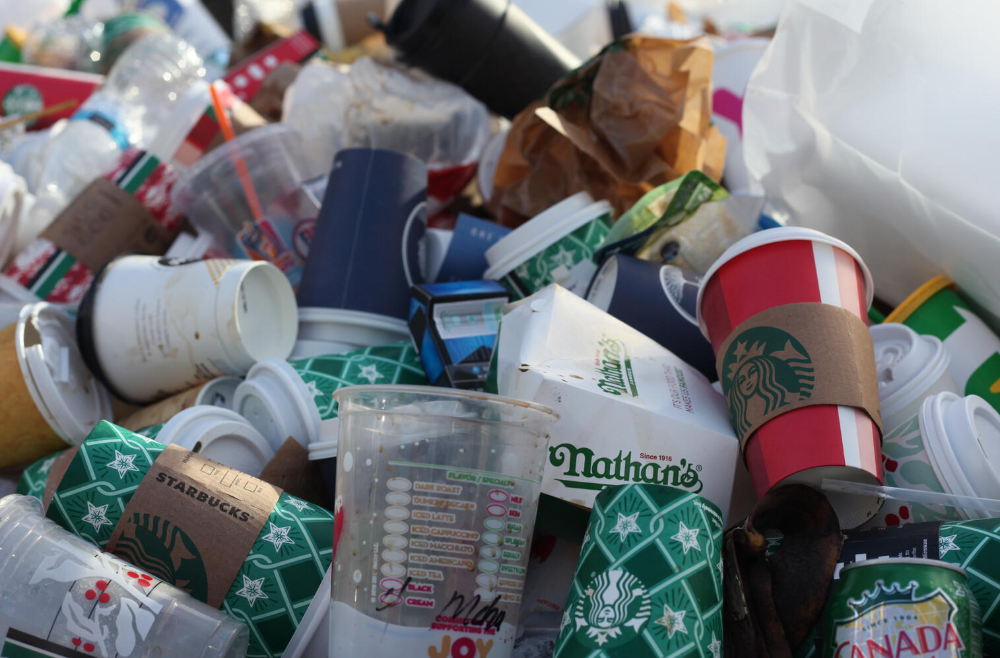

## 📊 소개 (Introduction)
------

### 데이터 교육 크리에이터 (Data Educator)

> 프로그래밍: Python, R, SQL, Excel, Git \
> 클라우드: AWS \
> 시각화: Tableau, Power BI, Looker, Streamlit \
> Business Analytics, Data Engineering
와 관련된 **(라이브 강의, 온라인 클래스, 교육 컨텐츠)** 를 만듭니다.

- 📊데이터로 성장하고 싶은 탐험가들이 더욱 재미있고 가치있게 배울수 있게 돕는 
교육 크리에이터, 리차드입니다.

- 📖 심리학과에서 시작하여 
📊데이터 분석가 와 🔧데이터 엔지니어로 근무한 후,
현재는 📺 데이터 교육 크리에이터로 활동하고 있어요.

## 📊 교육 (Education)
------
🏫 **Master of Business Analytics** (2023-2025)

- University of Utah - David Eccles School of Business

🏫 **Bachelor's of Data Science** (2011-2020)
- Brigham Young University - Idaho

## 📊 직무 경험 (Experience)
------

**BI 엔지니어** @ Amazon (2022.05 - 2023.04)

- 파이넨스 데이터 분석 모델링을 통한 주요 KPI 추적 및 BI 자동화 툴 개발
- 엑셀과 VBA로 구성된 데이터 분석 모델을 AWS 기술 스택으로 전환하여 연간 분석 시간을 300 시간 절약 

**데이터 엔지니어** @ Amazon (2021.08 - 2022.05)

- AWS 판매 실적 리포트를 자동화하기 위한 ETL 파이프라인 개발 및 유지 보수
- AWS S3, Step Function, Glue, Athena, Cloudwatch 를 사용하여 리포트 랜딩 시간을 25% 단축

**데이터 분석가** @ BYU-Pathway Worldwide (2020.08 - 2021.06)

- 온라인 학생들의 수업 과목별 리텐션 향상을 위한 데이터 컨설팅 & 데이터 전략 수립
- 온라인 교육의 심리학적 요인울 체계적으로 분석하여 변수 별로 영향력 측정 및 모델링

## 📊 프로젝트 (Project)
------

[딥러닝: 쓰레기 분류 모델 만들기](https://github.com/dongchanlim/Python-Machine-Learning/blob/main/Semester_Project.ipynb)
- CNN 모델을 사용하여 재활용 쓰레기 이미지로 종류를 분류하는 예측 모델을 만들었습니다.

[뉴욕시 에어비엔비 태블로 분석](https://public.tableau.com/app/profile/dongchan.lim/viz/AirbnbPractice_15699654202660/Story1)
- 뉴욕시에 있는 에어비엔비의 데이터를 시각화하여 고객들이 숙소 가격 과 평점을 한눈에 보고 비교할 수 있어요!
